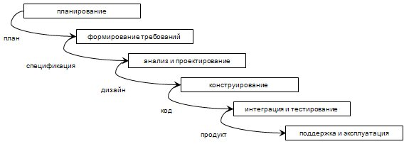
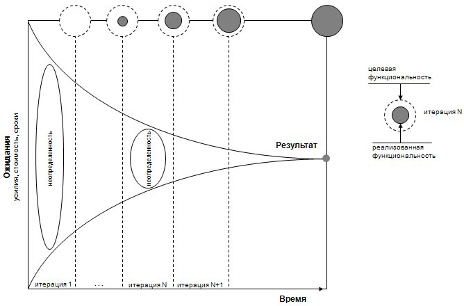

# Модели жизненного цикла программного обеспечения

Одним из ключевых понятий управления проектами, в том числе в приложении к
индустрии программного обеспечения, является *жизненный цикл проекта* (*Project
Lifecycle Management* - PLM).

Известный эксперт по управлению высокотехнологичными проетами Арчибальд так
определяет жизненный цикл проекта [Арчибальд Р., 2003, с.58-59] [Арчибальд Р.,
2005]:

> “Жизненный цикл проекта имеет определенные начальную и конечную точки,
привязанные к временной шкале. Проект в своем естественном развитии проходит
ряд отдельных фаз.

> Жизненный цикл проекта включает все фазы от момента инициации до момента
завершения. Переходы от одного этапа к другому редко четко определены, за
исключением тех случаев, когда они формально разделяются принятием предложения
или получением разрешения на продолжение работы. Однако, в начале
концептуальной фазы часто возникают сложности с точным определением момента,
когда работу можно уже идентифицировать как проект (в терминах управления
проектами), особенно если речь идет о разработке нового продукта или новой
услуги.

> Существует общее соглашение о выделении четырех обобщенных фаз жизненного
цикла (в скобках приведены используемые в различных источниках альтернативные
термины):
  - концепция (инициация, идентификация, отбор)
  - определение (анализ)
  - выполнение (практическая реализация или внедрение, производство и
развертывание, проектирование или конструирование, сдача в эксплуатацию,
инсталляция, тестирование и т.п.)
  - закрытие (завершение, включая оценивание после завершения)

> Однако, эти фазы столь широки, что ... необходимы конкретные определения,
быть может пяти-десяти основных фаз для каждой категории и подкатегории
проекта, обычно с несколькими подфазами, выделяемыми внутри каждой из этих фаз.

> ...Нередко можно наблюдать частичное совмещение или одновременное выполнение
фаз проекта, называемое “быстрым проходом” в строительных и инжиниринговых
проектах и “параллелизмом” – в военных и аэрокосмических. Это усложняет
планирование проекта и координацию усилий его участников, а также делает более
важной роль менеджера проектов.”

В общем случае, *жизненный цикл определяется моделью и описывается в форме
методологии (метода)*. *Модель* или *парадигма* жизненного цикла определяет
концептуальный взгляд на организацию жизненного цикла и, часто, основные фазы
жизненного цикла и принципы перехода между ними. *Методология* (метод) задает
комплекс работ, их детальное содержание и ролевую ответственность специалистов
на всех этапах выбранной модели жизненного цикла, обычно определяет и саму
модель, а также рекомендует *практики (best practices)*, позволяющие
максимально эффективно воспользоваться соответствующей методологией и ее
моделью.

В индустрии программного обеспечения можно (так как это уже конкретная область
приложения концепций и практик проектного управления) и необходимо (для
обеспечения возможности управления) более четкое разграничение фаз проекта (что
не подразумевает их линейного и последовательного выполнения).

Ниже приведены определения модели жизненного цикла программной системы,
даваемые, например, в различных вариантах стандартов ГОСТ:
- Модель жизненного цикла - структура, состоящая из процессов, работ и задач,
включающих в себя разработку, эксплуатацию и сопровождение программного
продукта, охватывающая жизнь системы от установления требований к ней до
прекращения ее использования [ГОСТ 12207, 1999].
- Жизненный цикл автоматизированной системы (АС) - совокупность взаимосвязанных
процессов создания и последовательного изменения состояния АС, от формирования
исходных требований к ней до окончания эксплуатации и утилизации комплекса
средств автоматизации АС [ГОСТ 34, 1990].

Один из них - ГОСТ Р ИСО/МЭК 12207 является переводом международного стандарта
ISO/IEC 12207, на основе которого, в свою очередь, создан соответствующий
стандарт IEEE 12207. Второй – в рамках семейства ГОСТ 34 – разрабатывался в
СССР самостоятельно, как стандарт на содержание и оформление документов на
программные системы в рамках Единой системы программной документации (ЕСПД) и
Единой системы конструкторской документации (ЕСКД). В последние годы, акцент
делается на стандарты ГОСТ, соответствующие международным стандартам. В то же
время, 34-я серия является важным дополнительным источником информации для
разработки и стандартизации внутрикорпоративных документов и формирования
целостного понимания и видения концепций жизненного цикла в области
программного обеспечения.

В определённом контексте, “модель” и “методология” могут использоваться
взаимозаменяемым образом, например, когда мы обсуждаем разграничение фаз
проекта. Говоря “жизненный цикл” мы, в первую очередь, подразумеваем “модель
жизненного цикла”. Несмотря на данное в стандартах 12207 определение модели
жизненного цикла, все же, *модель* чаще подразумевает именно *общий принцип*
организации жизненного цикла, чем детализацию соответствующих работ.
Соответственно, определение и выбор модели, в первую очередь, касается вопросов
определенности и стабильности требований, жесткости и детализированности плана
работ, а также частоты сборки работающих версий создаваемой программной
системы.

Скотт Амблер (Scott W. Ambler) [Ambler, 2005], автор концепций и практик
гибкого моделирования (Agile Modeling) и Enterprise Unified Process (расширение
Rational Unified Process), предлагает следующие уровни жизненного цикла,
определяемые соответствующим содержанием работ (см. рис.1):

- Жизненный цикл разработки программного обеспечения – проектная деятельность
по разработке и развертыванию программных систем
- Жизненный цикл программной системы – включает разработку, развертывание,
поддержку и сопровождение
- Жизненный цикл информационных технологий (ИТ) – включает всю деятельность
ИТ-департамента
- Жизненный цикл организации/бизнеса – охватывает всю деятельность организации
в целом

![Рисунок 1. Содержание четырех категорий жизненного цикла по Амблеру(используется с разрешения автора) [Ambler, 2005]](images/lifecycle_categories-ambler.jpg)

В данном контексте, SWEBOK описывает области знаний *жизненного цикла системы*
и *жизненного цикла разработки* программного обеспечения. В свою очередь, как
упоминается в SWEBOK, одним из фундаментальных взглядов на жизненный цикл
является стандарт процессов жизненного цикла ISO/IEC, IEEE, ГОСТ Р ИСО/МЭК
12207.

## Стандарт 12207: Процессы жизненного цикла программного обеспечения

В 1997 году Международная Организация по Стандартизации - ИСО (International
Organization for Standardization - ISO) и Международная Электротехническая
Комиссия - МЭК (International Electrotechnical Commission - IEC) создали
Совместный Технический Комитет по Информационным Технологиям - Joint Technical
Committee (JTC1) on Information Technology. Содержание работ JTC1 определено
как “стандартизация в области систем и оборудования информационных технологий
(включая микропроцессорные системы)”. В 1989 году этот комитет инициировал
разработку стандарта ISO/IEC 12207, создав для этого подкомитет SC7
(SuСommittee 7) по программной инженерии. Соответствующий стандарт впервые был
опубликован 1-го августа 1995 года под заголовком “Software Life Cycle
Processes” – “Процессы жизненного цикла программного обеспечения”. Национальный
стандарт [ГОСТ 12207, 1999] получил название “Процессы жизненного цикла
программных средств”.

Цель разработки данного стандарта была определена как создание общего
фреймворка по организации жизненного цикла программного обеспечения для
формирования общего понимания жизненного цикла ПО всеми заинтересованными
сторонами и участниками процесса разработки приобретения, поставки,
эксплуатации, поддержки и сопровождения программных систем, а также возможности
управления, контроля и совершенствования процессов жизненного цикла.

Данный стандарт определяет жизненный цикл как структуру декомпозиции работ.
Детализация, техники и метрики проведения работ – вопрос программной инженерии.
Организация последовательности работ – модель жизненного цикла. Совокупность
моделей, процессов, техник и организации проектной группы задаются
методологией. В частности, выбор и применение метрик оценки качества
программной системы и процессов находятся за рамками стандарта 12207, а
концепция совершенствования процессов рассматривается в стандарте ISO/IEC 15504
“Information Technology - Software Process Assessment” (“Оценка процессов в
области программного обеспечения”).

Необходимо отметить заложенные в стандарте ключевые концепции рассмотрения
жизненного цикла программных систем.

### Организация стандарта и архитектура жизненного цикла

Стандарт определяет область его применения, дает ряд важных определений (таких,
как заказчик, разработчик, договор, оценка, выпуск – релиз, программный
продукт, аттестация и т.п.), процессы жизненного цикла и включает ряд
примечаний по процессу и вопросам адаптации стандарта.

Стандарт описывает 17 процессов жизненного цикла, распределенных по трем
категориям – группам процессов (названия представлены с указанием номеров
разделов стандарта, следуя определениям на русском и английском языке,
определяемыми [ГОСТ 12207, 1999] и оригинальной версией ISO/IEC 12207,
соответственно):

### Основные процессы жизненного цикла - Primary Processes

5.1 Заказ - Acquisition
5.2 Поставка - Supply
5.3 Разработка - Development
5.4 Эксплуатация - Operation
5.5 Сопровождение - Maintenance

### Вспомогательные процессы жизненного цикла – Supporting Processes

6.1 Документирование - Documentation
6.2 Управление конфигурацией – Configuration Management
6.3 Обеспечение качества – Quality Assurance
6.4 Верификация - Verification
6.5 Аттестация - Validation
6.6 Совместный анализ – Joint Review
6.7 Аудит - Audit
6.8 Решение проблем – Problem Resolution

### Организационные процессы жизненного цикла – Organizational Processes

7.1 Управление - Management
7.2 Создание инфраструктуры - Infrastructure
7.3 Усовершенствование - Improvement
7.4 Обучение - Training

Стандарт определяет высокоуровневую архитектуру жизненного цикла. Жизненный
цикл начинается с идеи или потребности, которую необходимо удовлетворить с
использованием программных средств (может быть и не только их). Архитектура
строится как набор процессов и взаимных связей между ними. Например, основные
процессы жизненного цикла обращаются к вспомогательным процессам, в то время,
как организационные процессы действуют на всем протяжении жизненного цикла и
связаны с основными процессами.

Дерево процессов жизненного цикла представляет собой структуру декомпозиции
жизненного цикла на соответствующие процессы (группы процессов). Декомпозиция
процессов строится на основе двух важнейших принципов , определяющих правила
разбиения (partitioning) жизненного цикла на составляющие процессы. Эти
принципы:

Модульность

- задачи в процессе являются функционально связанными;
- связь между процессами – минимальна;
- если функция используется более, чем одним процессом, она сама является
процессом;
- если Процесс Y используется Процессом X и только им, значит Процесс Y
принадлежит (является его частью или его задачей) Процессу X, за исключением
случаев потенциального использования Процесса Y в других процессах в будущем.

Ответственность

- каждый процесс находится под ответственностью конкретного лица (управляется
и/или контролируется им), определенного для заданного жизненного цикла,
например, в виде роли в проектной команде;
- функция, чьи части находятся в компетенции различных лиц, не может
рассматриваться как самостоятельный процесс.

Общая иерархия (декомпозиция) составных элементов жизненного цикла выглядит
следующим образом:

* группа процессов
    * процессы
        * работы
            * задачи

В общем случае, разбиение процесса базируется на широко распространённом PDCA-цикле:

- “P” – Plan – Планирование
- “D” – Do – Выполнение
- “C” – Check – Проверка
- “A” – Act – Реакция (действие)

Рассмотрим вкратце, какие работы составляют процессы жизненного цикла, помня,
что полное определение работ, как и определение составляющих их задач, дано
непосредственно в стандарте. Ниже приведен краткий обзор основных процессов
жизненного цикла, явно демонстрирующий связь вопросов, касающихся
непосредственно самой программной системы, с системными аспектами ее
функционирования и обеспечения ее эксплуатации.

### Основные процессы жизненного цикла

#### Приобретение (5.1)

Процесс приобретения (как его называют в ГОСТ – “заказа”) определяет работы и
задачи заказчика, приобретающего программное обеспечение или услуги, связанные
с ПО, на основе контрактных отношений. Процесс приобретения состоит из
следующих работ (названия ГОСТ 12207 даны в скобках, если предлагают другой
перевод названий работ оригинального стандарта):

- Inititation – инициирование (подготовка)
- Request-for-proposal preparation – подготовка запроса на предложение
(подготовка заявки на подряд)
- Contract preparation and update –подготовка и корректировка договора
- Supplier monitoring – мониторинг поставщика (надзор за поставщиком)
- Acceptance and completion – приемка и завершение (приемка и закрытие договора)

Все работы проводятся в рамках проектного подхода.

#### Поставка (5.2)

Процесс поставки, в свою очередь, определяет работы и задачи поставщика. Работы
также проводятся с использованием проектного подхода. Процесс включает
следующие работы:

- Inititation – инициирование (подготовка)
- Preparation of response – подготовка предложения (подготовка ответа)
- Contract – разработка контракта (подготовка договора)
- Planning - планирование
- Execution and control – выполнение и контроль
- Review and evaluation –проверка и оценка
- Delivery and completion – поставка и завершение (поставка и закрытие
договора)

#### Разработка (5.3)

Процесс разработки определяет работы и задачи разработчика. Процесс состоит из
следующих работ:

- Process implementation – определение процесса (подготовка процесса)
- System requirements analysis – анализ системных требований (анализ требований
к системе)
- System design – проектирование системы (проектирование системной архитектуры)
- Software requirements analysis – анализ программных требований (анализ
требований к программным средствам)
- Software architectural design – проектирование программной архитектуры
- Software detailed design – детальное проектирование программной системы
(техническое проектирование программных средств)
- Software coding and testing – кодирование и тестирование (программирование и
тестирование программных средств)
- Software integration – интеграция программной системы (сборка программных
средств)
- Software qualification testing – квалификационные испытания программных
средств
- System integration – интеграция системы в целом (сборка системы)
- System qualification testing – квалификационные испытания системы
- Software installation – установка (ввод в действие)
- Software acceptance support – обеспечение приемки программных средств

Стандарт отмечает, что работы проводятся с использованием проектного подхода и
могут пересекаться по времени, т.е. проводиться одновременно или с наложением,
а также могут предполагать рекурсию и разбиение на итерации.

#### Эксплуатация (5.4)

Процесс разработки определяет работы и задачи оператора службы поддержки.
Процесс включает следующие работы:

- Process implementation – определение процесса (подготовка процесса)
- Operational testing – операционное тестирование (эксплуатационные испытания)
- System operation – эксплуатация системы
- User support – поддержка пользователя

#### Сопровождение (5.5)

Процесс разработки определяет работы и задачи, проводимые специалистами службы
сопровождения. Процесс включает следующие работы:

- Process implementation – определение процесса (подготовка процесса)
- Problem and modification analysis – анализ проблем и изменений
- Modification implementation – внесение изменений
- Maintenance review/acceptance – проверка и приемка при сопровождении
- Migration – миграция (перенос)
- Software retirement – вывод программной системы из эксплуатации (снятие с
эксплуатации)

Важно понимать, что стандарт 12207 не определяет последовательность и разбиение
выполнения процессов во времени, адресуя этот вопрос также работам по адаптации
стандарта к конкретным условиям и окружению и применению выбранных моделей,
практик, техник и т.п.

### Адаптация стандарта

Адаптация стандарта* подразумевает применение требований стандарта к
конкретному проекту или проектам, например, в рамках создания
внутрикорпоративных регламентов ведения проектов программного обеспечения.

Адаптация включает следующие виды работ:

- Определение исходной информации для адаптации стандарта
- Определение условий выполнения проекта
- Отбор процессов, работ и задач, используемых в проекте или соответствующих регламентах
- Документирование требований, решений и процессов, связанных с адаптацией и
полученных в ее результате

Адаптация также подразумевает выбор модели (или комбинации моделей) жизненного
цикла, а также применение соответствующих методологий, детализирующих процедуры
выполнения процессов, работ и задач в рамках заданных границ (содержания)
жизненного цикла программного обеспечения и организационной структуры и ролевой
ответственности в конкретной организации (ее подразделении) и/или в проектной
группе.

* Необходимо отметить, что существует еще один стандарт жизненного цикла -
ISO/IEC 15288 (выпущен в 2002 году), фокусирующийся на вопросах организации
процессов жизненного цикла системного уровня (Life Cycle Processes – System) и
включающий специальный процесс - “Tailoring”, т.е. настройку, адаптацию
жизненного цикла к конкретным требованиям и ограничениям, существующим или
принятым в конкретной организации/подразделении или для заданного проекта.

## Модели жизненного цикла

Наиболее часто говорят о следующих моделях жизненного цикла:

- Каскадная (водопадная) или последовательная
- Итеративная и инкрементальная – эволюционная (гибридная, смешанная)
- Спиральная (spiral) или модель Боэма

Легко обнаружить, что в разное время и в разных источниках приводится разный
список моделей и их интерпретация. Например, ранее, инкрементальная модель
понималась как построение системы в виде последовательности сборок (релизов),
определенной в соответствии с заранее подготовленным планом и заданными (уже
сформулированными) и неизменными требованиями. Сегодня об инкрементальном
подходе чаще всего говорят в контексте постепенного наращивания
функциональности создаваемого продукта.

Может показаться, что индустрия пришла, наконец, к общей “правильной” модели.
Однако, каскадная модель, многократно “убитая” и теорией и практикой,
продолжает встречаться в реальной жизни. Спиральная модель является ярким
представителем эволюционного взгляда, но, в то же время, представляет собой
единственную модель, которая уделяет явное внимание анализу и предупреждению
рисков. Поэтому, я попытался именно представленным выше образом выделить три
модели – каскадную, эволюционную и спиральную. Их мы и обсудим.

### Каскадная (водопадная) модель

Данная модель предполагает строго последовательное (во времени) и однократное
выполнение всех фаз проекта с жестким (детальным) предварительным планированием
в контексте предопределенных или однажды и целиком определенных требований к
программной системе.

На рисунке изображены типичные фазы каскадной модели жизненного цикла и
соответствующие активы проекта, являющиеся для одних фаз выходами, а для других
- входами. Марри Кантор [Кантор, 2002, с.145-146] отмечает ряд важных аспектов,
характерных для водопадной модели: “Водопадная схема включает несколько важных
операций, применимых ко всем проектам:

- составление плана действий по разработке системы;
- планирование работ, связанных с каждым действием;
- применение операции отслеживания хода выполнения действий с контрольными
этапами.

В связи с тем, что упомянутые задачи являются неотъемлемым элементом всех
хорошо управляемых процессов, практически не существует причин, препятствующих
утверждению полнофункциональных, классических методов руководства проектом,
таких как анализ критического пути и промежуточные контрольные этапы. Я часто
встречался с программными менеджерами, которые ломали себе голову над тем,
почему же столь эффективный набор методик на практике оборачивается
неудачей...”

Будучи активно используема (де факто и, например, в свое время, как часть
соответствующего отраслевого стандарта в США), эта модель продемонстрировала
свою “проблемность” в подавляющем большинстве ИТ-проектов, за исключением,
может быть, отдельных проектов обновления программных систем для
критически-важных программно-аппаратных комплексов (например, авионики или
медицинского оборудования). Практика показывает, что в реальном мире, особенно
в мире бизнес-систем, каскадная модель не должна применяться. Специфика таких
систем (если можно говорить о “специфике” для подавляющего большинства
создаваемых систем) - требования характеризуются высокой динамикой
корректировки и уточнения, невозможностью четкого и однозначного определения
требований до начала работ по реализации (особенно, для новых систем) и быстрой
изменчивостью в процессе эксплуатации системы.

Фредерик Брукс во втором издании своего классического труда “Мифический
человеко-месяц” так описывает главную беду каскадной модели [Брукс, 1995,
с.245]:

> “Основное заблуждение каскадной модели состоит в предположениях, что проект
проходит через весь процесс один раз, архитектура хороша и проста в
использовании, проект осуществления разумен, а ошибки в реализации устраняются
по мере тестирования. Иными словами, каскадная модель исходит из того, что все
ошибки будут сосредоточены в реализации, а потому их устранение происходит
равномерно во время тестирования компонентов и системы.”

В каскадной модели переход от одной фазы проекта к другой предполагает полную
корректность результата (выхода) предыдущей фазы. Однако, например, неточность
какого-либо требования или некорректная его интерпретация, в результате,
приводит к тому, что приходится “откатываться” к ранней фазе проекта и
требуемая переработка не просто выбивает проектную команду из графика, но
приводит часто к качественному росту затрат и, не исключено, к прекращению
проекта в той форме, в которой он изначально задумывался. Кроме того, эта
модель не способна гарантировать необходимую скорость отклика и внесение
соответствующих изменений в ответ на быстро меняющиеся потребности
пользователей, для которых программная система является одним из инструментов
исполнения бизнес-функций. И таких примеров проблем, порождаемых самой природой
модели, можно привести достаточно много. Достаточно для чего? Для отказа от
каскадной модели жизненного цикла.

### Итеративная и инкрементальная модель – эволюционный подход

Итеративная модель предполагает разбиение жизненного цикла проекта на
последовательность итераций, каждая из которых напоминает “мини-проект”,
включая все фазы жизненного цикла в применении к созданию меньших фрагментов
функциональности, по сравнению с проектом, в целом. Цель каждой итерации –
получение работающей версии программной системы, включающей функциональность,
определенную интегрированным содержанием всех предыдущих и текущей итерации.
Результата финальной итерации содержит всю требуемую функциональность продукта.
Таким образом, с завершением каждой итерации, продукт развивается
инкрементально.

С точки зрения структуры жизненного цикла такую модель называют итеративной
(iterative). С точки зрения развития продукта – инкрементальной (incremental).
Опыт индустрии показывает, что невозможно рассматривать каждый из этих взглядов
изолировано. Чаще всего такую смешанную эволюционную модель называют просто
итеративной (говоря о процессе) и/или инкрементальной (говоря о наращивании
функциональности продукта).

Эволюционная модель подразумевает не только сборку работающей (с точки зрения
результатов тестирования) версии системы, но и её развертывание в реальных
операционных условиях с анализом откликов пользователей для определения
содержания и планирования следующей итерации. “Чистая” инкрементальная модель
не предполагает развертывания промежуточных сборок (релизов) системы и все
итерации проводятся по заранее определённому плану наращивания
функциональности, а пользователи (заказчик) получает только результат финальной
итерации как полную версию системы. С другой стороны, Скотт Амблер [Ambler,
2004], например, определяет эволюционную модель как сочетание итеративного и
инкрементального подходов. В свою очередь, Мартин Фаулер [Фаулер, 2004, с.47]
пишет: “Итеративную разработку называют по-разному: инкрементальной,
спиральной, эволюционной и постепенной. Разные люди вкладывают в эти термины
разный смысл, но эти различия не имеют широкого признания и не так важны, как
противостояние итеративного метода и метода водопада.”
Брукс пишет [Брукс, 1995, с.246-247], что, в идеале, поскольку на каждом шаге мы имеем работающую систему:

- можно очень рано начать тестирование пользователями;
- можно принять стратегию разработки в соответствии с бюджетом, полностью
защищающую от перерасхода времени или средств (в частности, за счет сокращения
второстепенной функциональности).

Таким образом, Значимость эволюционного подхода на основе организации итераций
особо проявляется в снижении неопределенности с завершением каждой итерации. В
свою очередь, снижение неопределенности позволяет уменьшить риски. Рисунок 3
иллюстрирует некоторые идеи эволюционного подхода, предполагая, что
итеративному разбиению может быть подвержен не только жизненный цикл в целом,
включающий перекрывающиеся фазы – формирование требований, проектирование,
конструирование и т.п., но и каждая фаза может, в свою очередь, разбиваться на
уточняющие итерации, связанные, например, с детализацией структуры декомпозиции
проекта – например, архитектуры модулей системы.

Наиболее известным и распространённым вариантом эволюционной модели является
спиральная модель, ставшая уже по сути самостоятельной моделью, имеющей
различные сценарии развития и детализации.

### Спиральная модель

Спиральная модель (представлена на рисунке 4) была впервые сформулирована Барри
Боэмом (Barry Boehm) в 1988 году [Boehm, 1988]. Отличительной особенностью этой
модели является специальное внимание рискам, влияющим на организацию жизненного
цикла.

Боэм формулирует “top-10” наиболее распространенных (по приоритетам) рисков
(используется с разрешения автора):

1. Дефицит специалистов.
1. Нереалистичные сроки и бюджет.
1. Реализация несоответствующей функциональности.
1. Разработка неправильного пользовательского интерфейса.
1. “Золотая сервировка”, перфекционизм, ненужная оптимизация и оттачивание
деталей.
1. Непрекращающийся поток изменений.
1. Нехватка информации о внешних компонентах, определяющих окружение системы
или вовлеченных в интеграцию.
1. Недостатки в работах, выполняемых внешними (по отношению к проекту) ресурсами.
1. Недостаточная производительность получаемой системы.
1. “Разрыв” в квалификации специалистов разных областей знаний.

Большая часть этих рисков связана с организационными и процессными аспектами
взаимодействия специалистов в проектной команде.

![Рисунок 4. Оригинальная спиральная модель жизненного цикла разработки по Боэму (используется с разрешения автора) [Boehm, 1988]](images/lifecycle_spiral-boehm.jpg)

Сам Барри Боэм так характеризует спиральную модель разработки (используется с
разрешения автора):

> “Главное достижение спиральной модели состоит в том, что она предлагает
спектр возможностей адаптации удачных аспектов существующих моделей процессов
жизненного цикла. В то же время, ориентированный на риски подход позволяет
избежать многих сложностей, присутствующих в этих моделях. В определенных
ситуациях спиральная модель становится эквивалентной одной из существующих
моделей. В других случаях она обеспечивает возможность наилучшего соединения
существующих подходов в контексте данного проекта.

> Спиральная модель обладает рядом преимуществ:

> Модель уделяет специальное внимание раннему анализу возможностей повторного
использования. Это обеспечивается, в первую очередь, в процессе идентификации и
оценки альтернатив.

> Модель предполагает возможность эволюции жизненного цикла, развитие и
изменение программного продукта. Главные источники изменений заключены в целях,
для достижения которых создается продукт. Подход, предусматривающий скрытие
информации о деталях на определённом уровне дизайна, позволяет рассматривать
различные архитектурные альтернативы так, как если бы мы говорили о
единственном проектном решении, что уменьшает риск невозможности согласования
функционала продукта и изменяющихся целей (требований).

> Модель предоставляет механизмы достижения необходимых параметров качества как
составную часть процесса разработки программного продукта. Эти механизмы
строятся на основе идентификации всех типов целей (требований) и ограничений на
всех “циклах” спирали разработки. Например, ограничения по безопасности могут
рассматриваться как риски на этапе специфицирования требований.

> Модель уделяет специальное внимание предотвращению ошибок и отбрасыванию
ненужных, необоснованных или неудовлетворительных альтернатив на ранних этапах
проекта. Это достигается явно определёнными работами по анализу рисков,
проверке различных характеристик создаваемого продукта (включая архитектуру,
соответствие требованиям и т.п.) и подтверждение возможности двигаться дальше
на каждом “цикле” процесса разработки.

> Модель позволяет контролировать источники проектных работ и соответствующих
затрат. По-сути речь идет об ответе на вопрос – как много усилий необходимо
затратить на анализ требований, планирование, конфигурационное управление,
обеспечение качества, тестирование, формальную верификацию и т.д. Модель,
ориентированная на риски, позволяет в контексте конкретного проекта решить
задачу приложения адекватного уровня усилий, определяемого уровнем рисков,
связанных с недостаточным выполнением тех или иных работ.

> Модель не проводит различий между разработкой нового продукта и расширением
(или сопровождением) существующего. Этот аспект позволяет избежать часто
встречающегося отношения к поддержке и сопровождению как ко “второсортной”
деятельности. Такой подход предупреждает большого количество проблем,
возникающих в результате одинакового уделения внимания как обычному
сопровождению, так и критичным вопросам, связанным с расширением
функциональности продукта, всегда ассоциированным с повышенными рисками.

> Модель позволяет решать интегрированные задачи системной разработки,
охватывающей и программную и аппаратную составляющие создаваемого продукта.
Подход, основанный на управлении рисками и возможности своевременного
отбрасывания непривлекательных альтернатив (на ранних стадиях проекта)
сокращает расходы и одинаково применим и к аппаратной части, и к программному
обеспечению.”

Описывая созданную спиральную модель, Боэм обращает внимание на то, что обладая
явными преимуществами по сравнению с другими взглядами на жизненный цикл,
необходимо уточнить, детализировать шаги, т.е. циклы спиральной модели для
обеспечения целостного контекста для всех лиц, вовлеченных в проект (Боэм это
формулирует так: “Need for further elaboration of spiral model steps. In
general, the spiral model process steps need further elaboration to ensure that
all software development participants are operating in a consistent context.”).
Организация ролей (ответственности членов проектной команды), детализация
этапов жизненного цикла и процессов, определение активов (артефактов), значимых
на разных этапах проекта, практики анализа и предупреждения рисков – все это
вопросы уже конкретного процессного фреймворка или, как принято говорить,
*методологии разработки*.

Действительно, детализация процессов, ролей и активов – вопрос методологии.
Однако, рассматривая (спиральную) модель разработки, являясь концептуальным
взглядом на создание продукта, требует, как и в любом проекте, *определения
ключевых контрольных точек проекта - milestones*. Это, в большой степени,
связано с попыткой ответить на вопрос “где мы?”. Вопрос, особенно актуальный
для менеджеров и лидеров проектов, отслеживающих ход их выполнения и
планирующих дальнейшие работы.
В 2000 году [Boehm, 2000], представляя анализ использования спиральной модели
и, в частности, построенного на его основе подхода MBASE - Model-Based (System)
Architecting and Software Engineering (MBASE), Боэм формулирует 6 ключевых
характеристик или практик, обеспечивающих успешное применение спиральной
модели:

1. Параллельное, а не последовательное определение артефактов (активов) проекта
1. Согласие в том, что на каждом цикле уделяется внимание:

  - целям и ограничениям, важным для заказчика
  - альтернативам организации процесса и технологических решений, закладываемых в продукт
  - идентификации и разрешению рисков
  - оценки со стороны заинтересованных лиц (в первую очередь заказчика)
  - достижению согласия в том, что можно и необходимо двигаться дальше
1. Использование соображений, связанных с рисками, для определения уровня
усилий, необходимого для каждой работы на всех циклах спирали.
1. Использование соображений, связанных с рисками, для определения уровня
детализации каждого артефакта, создаваемого на всех циклах спирали.
1. Управление жизненным циклом в контексте обязательств всех заинтересованных
лиц на основе трех контрольных точек:
  - Life Cycle Objectives (LCO)
  - Life Cycle Architecture (LCA)
  - Initial Operational Capability (IOC)
1. Уделение специального внимания проектным работам и артефактам создаваемой
системы (включая непосредственно разрабатываемое программное обеспечение, ее
окружение, а также эксплуатационные характеристики) и жизненного цикла
(разработки и использования).

Эволюционирование спиральной модели, таким образом, связано с вопросами
детализации работ. Особенно стоит выделить акцент на большем внимании вопросам
уточнения – требований, дизайна и кода, т.е. придание большей важности вопросам
итеративности, в том числе, увеличения их количества при сокращении
длительности каждой итерации.

В результате, можно определить общий набор контрольных точек в сегодняшней
спиральной модели:

- *Concept of Operations (COO)* – концепция использования системы;
- *Life Cycle Objectives (LCO)* – цели и содержание жизненного цикла;
- *Life Cycle Architecture (LCA)* – архитектура жизненного цикла; здесь же
возможно говорить о готовности концептуальной архитектуры целевой программной
системы;
- *Initial Operational Capability (IOC)* – первая версия создаваемого продукта,
пригодная для опытной эксплуатации;
- *FinalOperationalCapability (FOC)* – готовый продукт, развернутый
(установленный и настроенный) для реальной эксплуатации.
Таким образом, мы приходим к возможному современному взгляду (см., например,
представление спиральной модели в [Фатрелл, Шафер и Шафер, 2003, с.159]) на
итеративный и инкрементальный – эволюционный жизненный цикл в форме спиральной
модели, изображенной на рисунке 5.

Похоже, нам удалось более четко и естественно определить контрольные точки
проекта, в определенной степени, подчеркнув эволюционную природу жизненного
цикла. Теперь же пора взглянуть на жизненный цикл в контексте методологий, не
просто детализирующих ту или иную модель, но добавляющих к ним ключевой элемент
– людей. Роли, как представление различных функциональных групп работ,
связывает создание, модификацию и использование активов проектов с конкретными
участниками проектных команд. В совокупности с процессами и активами
(артефактами) они позволяют нам создать целостную и подробную картину
жизненного цикла.

Так как взглядов на детализацию описания жизненного цикла может быть много –
безусловно, существуют различные методологии, среди которых наибольшее
распространение получили:

- Rational Unified Process (RUP)
- Enterprise Unified Process (EUP)
- Microsoft Solutions Framework (MSF) в обоих представлениях: MSF for Agile и
MSF for CMMI (анонсированная изначально как “MSF Formal”)
- Agile-практики (eXtreme Programming (XP), Feature Driven Development (FDD),
Dynamic Systems Development Method (DSDM), SCRUM,...).
